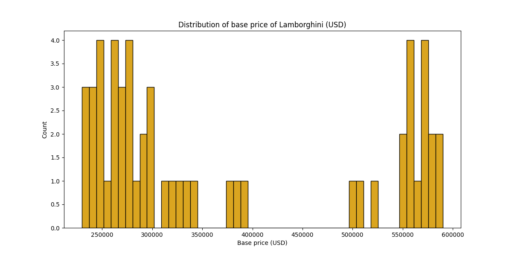
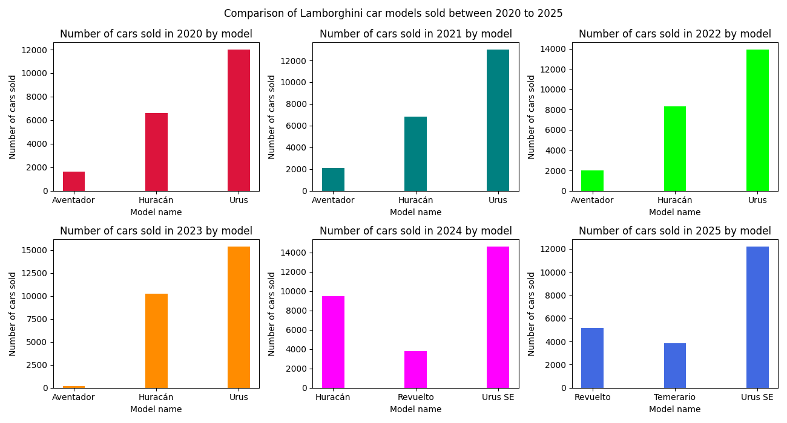
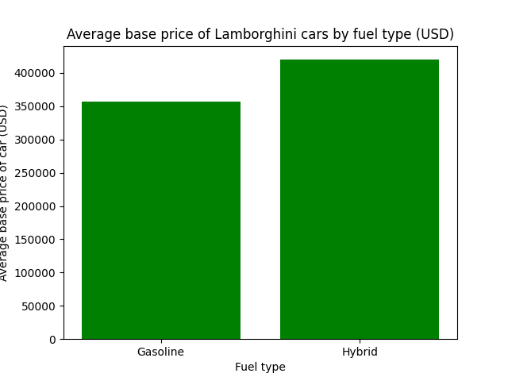
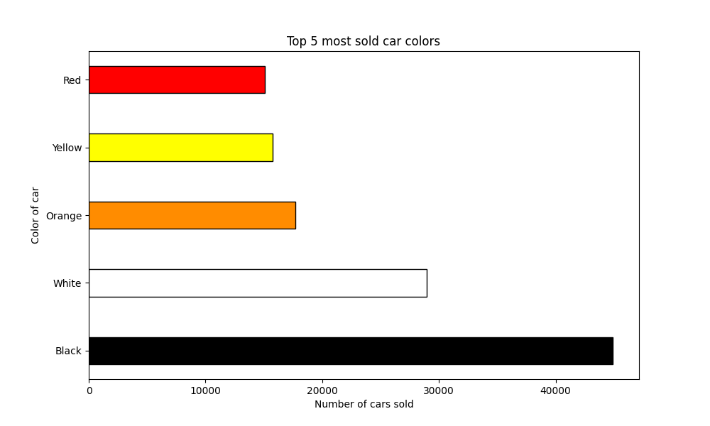
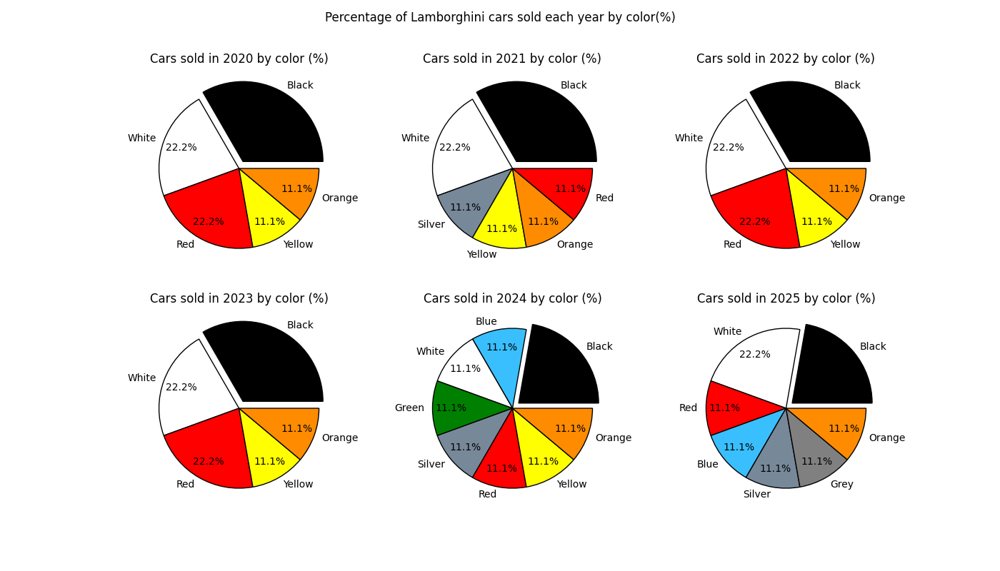
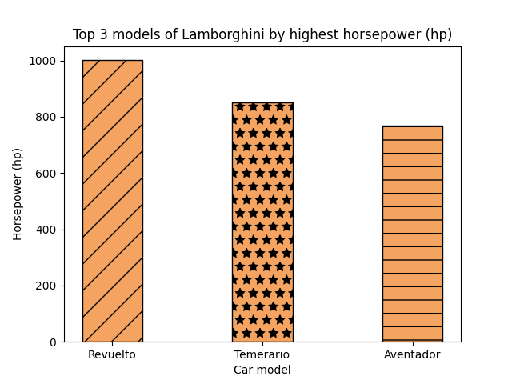

# Data Analysis of Lamborghini sales from 2020 to 2025🚘
This project analyses the sales of different models of Lamborghini cars from 2020 to 2025 in different regions. The goal is to clean the dataset, perform exploratory data analysis, data visualizations, and finding insights from the cleaned dataset. 

  
  
  
  
  
  
  
  

## Dataset🗂️
- Source: Kaggle 
- Source url: https://www.kaggle.com/datasets/hassaan2580/lamborghini-sales-2020-2025

## Kaggle Notebook📓
https://www.kaggle.com/code/reshmaharidhas/cleaning-eda-visualization-of-lamborghini-sales/notebook

## Visualizations💻

## Tech stack💻
- Pandas
- Matplotlib
- Python
- Numpy

## License
MIT License
